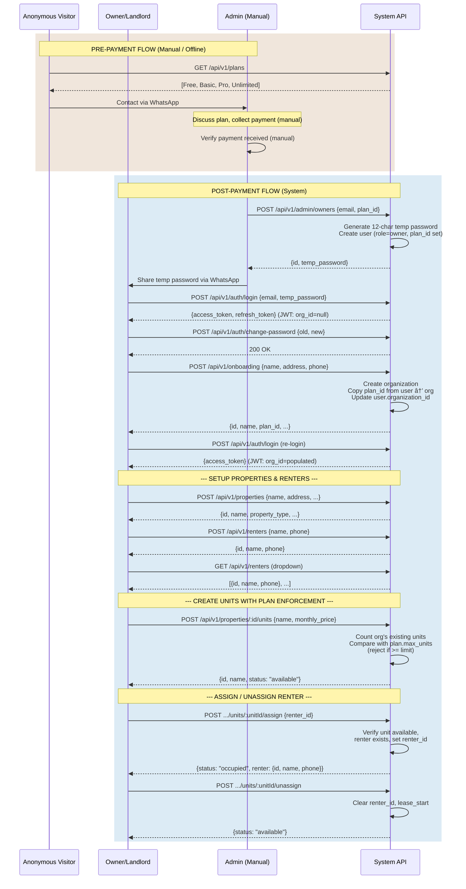

  
### Owner Register Flow

```mermaid
sequenceDiagram
    participant V as Anonymous Visitor
    participant O as Owner/Landlord
    participant A as Admin (Manual)
    participant S as System API

    rect rgb(240, 230, 220)
        Note over V,A: PRE-PAYMENT FLOW (Manual / Offline)
        V->>S: GET /api/v1/plans
        S-->>V: [Free, Basic, Pro, Unlimited]
        V->>A: Contact via WhatsApp
        Note over A: Discuss plan, collect payment (manual)
        A->>A: Verify payment received (manual)
    end

    rect rgb(220, 235, 245)
        Note over O,S: POST-PAYMENT FLOW (System)

        A->>S: POST /api/v1/admin/owners {email, plan_id}
        S->>S: Generate 12-char temp password<br/>Create user (role=owner, plan_id set)
        S-->>A: {id, temp_password}
        A->>O: Share temp password via WhatsApp

        O->>S: POST /api/v1/auth/login {email, temp_password}
        S-->>O: {access_token, refresh_token} (JWT: org_id=null)

        O->>S: POST /api/v1/auth/change-password {old, new}
        S-->>O: 200 OK

        O->>S: POST /api/v1/onboarding {name, address, phone}
        S->>S: Create organization<br/>Copy plan_id from user → org<br/>Update user.organization_id
        S-->>O: {id, name, plan_id, ...}

        O->>S: POST /api/v1/auth/login (re-login)
        S-->>O: {access_token} (JWT: org_id=populated)

        Note over O,S: --- SETUP PROPERTIES & RENTERS ---

        O->>S: POST /api/v1/properties {name, address, ...}
        S-->>O: {id, name, property_type, ...}

        O->>S: POST /api/v1/renters {name, phone}
        S-->>O: {id, name, phone}

        O->>S: GET /api/v1/renters (dropdown)
        S-->>O: [{id, name, phone}, ...]

        Note over O,S: --- CREATE UNITS WITH PLAN ENFORCEMENT ---

        O->>S: POST /api/v1/properties/:id/units {name, monthly_price}
        S->>S: Count org's existing units<br/>Compare with plan.max_units<br/>(reject if >= limit)
        S-->>O: {id, name, status: "available"}

        Note over O,S: --- ASSIGN / UNASSIGN RENTER ---

        O->>S: POST .../units/:unitId/assign {renter_id}
        S->>S: Verify unit available,<br/>renter exists, set renter_id
        S-->>O: {status: "occupied", renter: {id, name, phone}}

        O->>S: POST .../units/:unitId/unassign
        S->>S: Clear renter_id, lease_start
        S-->>O: {status: "available"}
    end
```
